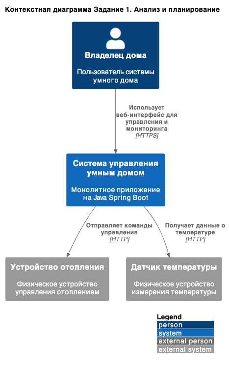
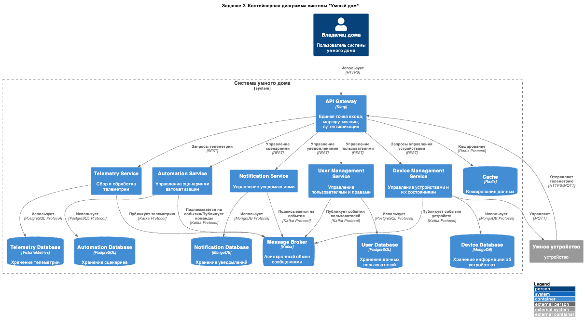
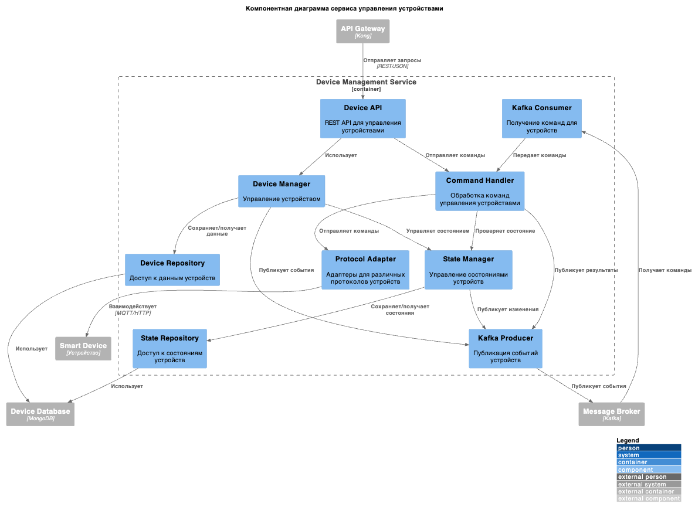
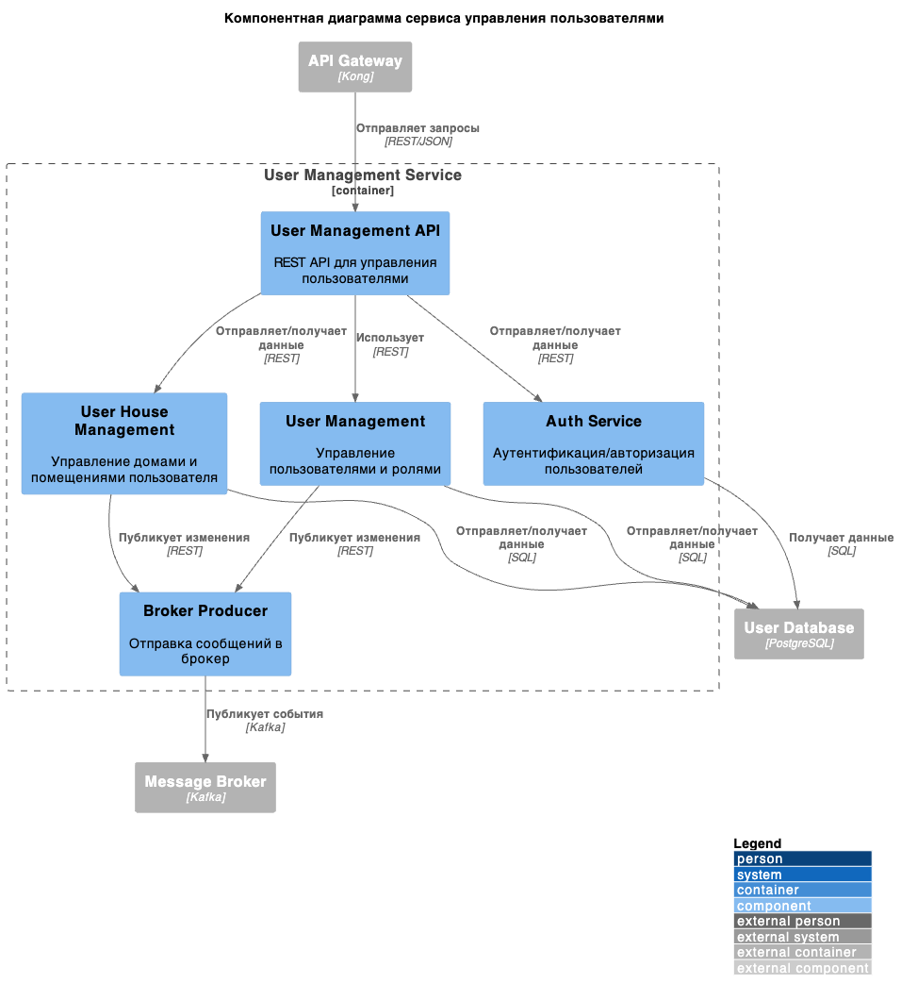
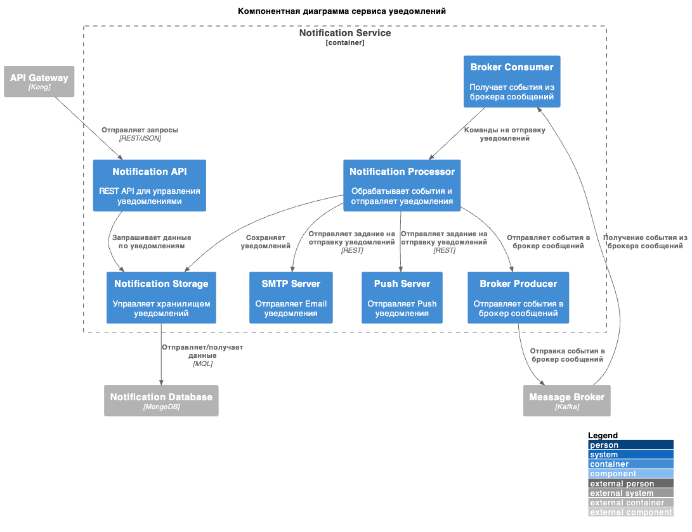
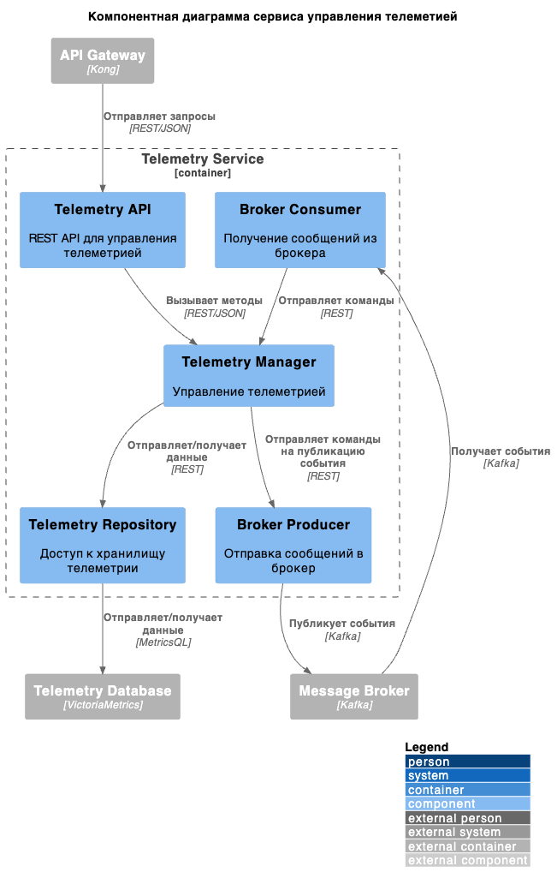
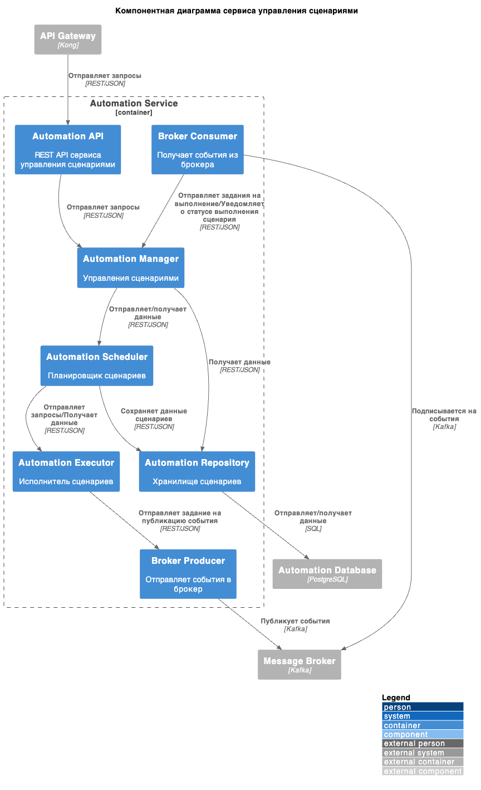
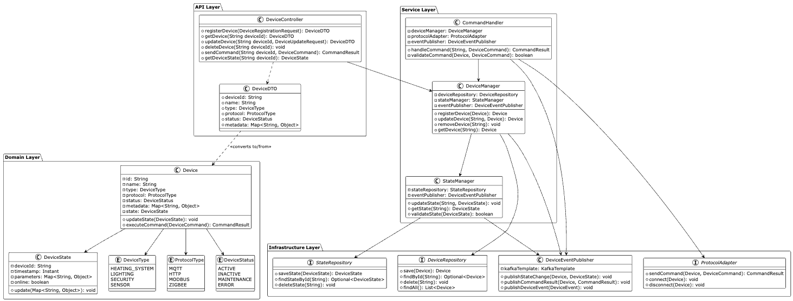
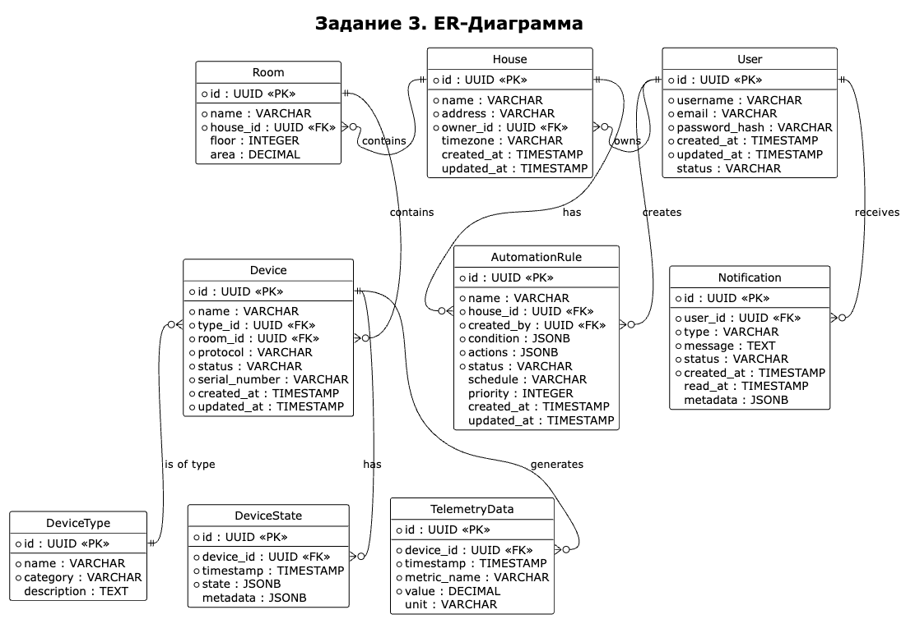

Это шаблон для решения **первой части** проектной работы. Структура этого файла повторяет структуру заданий. Заполняйте его по мере работы над решением.

# Задание 1. Анализ и планирование

Чтобы составить документ с описанием текущей архитектуры приложения, можно часть информации взять из описания компании условия задания. Это нормально.

### 1. Описание функциональности монолитного приложения

**Управление отоплением:**

- Пользователи могут устанавливать желаемую температуру
- Система поддерживае удаленно включать и выключать отопление в домах
- Взаимодействие с физическими устройствами происходит через синхронные HTTP-запросы
- Хранение состояния устройств в единой базе данных

**Мониторинг температуры:**

- Пользователи могу просматривать текущую температуру через веб-интерфейс
- Система поддерживае получение данных с температурных датчиков
- Данные хранятся в PostgreSQL базе данных
- Есть возможность отслеживания времени последнего обновления показаний датчиков

### 2. Анализ архитектуры монолитного приложения

Перечислите здесь основные особенности текущего приложения: какой язык программирования используется, какая база данных, как организовано взаимодействие между компонентами и так далее.

1. **Монолитная структура**
   - Вся бизнес-логика находится в одном приложении
   - Единая база данных PostgreSQL для всех функций
   - Тесная связь между компонентами
   - Отсутствие явного разделения на домены

2. **Синхронное взаимодействие**
   - Все операции выполняются синхронно
   - Прямые HTTP-запросы к устройствам
   - Отсутствие очередей сообщений
   - Потенциальные проблемы с масштабированием

### 3. Определение доменов и границы контекстов

Опишите здесь домены, которые вы выделили.

**Домен управления устройствами**
    - Устройства
    - Команда управления устройствами
    - Состояния устройств

- **Взаимодействует с:**
    - Доменом телеметрии (получение данных)
    - Доменом автоматизации (выполнение команд)
    - Доменом пользователей (проверка доступов)

**Домен телеметрии**
    - Температурные датчики
    - Показания датчиков
    - Время последнего обновления показаний

- **Взаимодействует с:**
    - Доменом управления устройствами (получение состояний)
    - Доменом автоматизации (предоставление данных для триггеров)

**Домен автоматицаций**
    - Сцерании
    - Управление триггерами

- **Взаимодействует с:**
    - Доменом управления устройствами (отправка команд)
    - Доменом телеметрии (получение данных для сцериев)
    - Доменом пользователей (проверка доступов)

**Домен пользователей**
    - Пользователь
    - Роль
    - Управление доступами

- **Взаимодействует с:**
    - Всеми остальными доменами (авторизация)
    

### **4. Проблемы монолитного решения**

1. **Масштабируемость**
   - Невозможность независимого масштабирования компонентов
   - Сложность с горизонтальным масштабированием из-за монолитной архитектуры
   - Риск перегрузки базы данных при росте количества устройств

2. **Отказоустойчивость**
   - Единая точка отказа - если падает монолит, падает вся система
   - Синхронные операции увеличивают риск каскадных сбоев

3. **Гибкость разработки**
   - Сложность внедрения новых функций без риска поломки существующих
   - Тесная связанность компонентов усложняет изменения
   - Отсутствие возможности использования разных технологий для разных задач

### 5. Визуализация контекста системы — диаграмма С4

# Задание 2. Проектирование микросервисной архитектуры

В этом задании вам нужно предоставить только диаграммы в модели C4. Мы не просим вас отдельно описывать получившиеся микросервисы и то, как вы определили взаимодействия между компонентами To-Be системы. Если вы правильно подготовите диаграммы C4, они и так это покажут.

**Диаграмма контейнеров (Containers)**

**Диаграмма компонентов (Components)**

Добавьте диаграмму для каждого из выделенных микросервисов.

1. **Сервис управления устройствами**

2. **Сервис управления пользователями**

3. **Сервис уведомлений**

4. **Сервис телеметрии**

5. **Сервис управления сценариями**

**Диаграмма кода (Code)**

Добавьте одну диаграмму или несколько.

# Задание 3. Разработка ER-диаграммы

Добавьте сюда ER-диаграмму. Она должна отражать ключевые сущности системы, их атрибуты и тип связей между ними.

